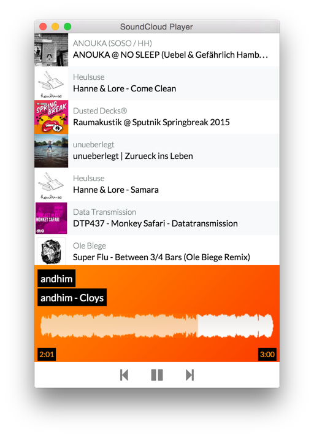

# Desktop client for SoundCloud

Desktop client for SounCloud with support for global media hotkeys. This started as an experiment with [electron](http://electron.atom.io/).

Currently only displays your favourite tracks!

Developed, tested and built for OSX only (for now).



# Download latest version for OSX

[SoundCloudPlayer-0.0.1-beta.zip](https://github.com/volkert/soundcloud-player/releases/download/0.0.1-beta/SoundCloudPlayer-0.0.1-beta.zip)

## Install dependencies

```
$ npm install
$ bower install
```

### Run

```
$ npm start
```

### Build

```
$ make
```

## License

MIT © [Volker Tietz](http://github.com/volkert)
